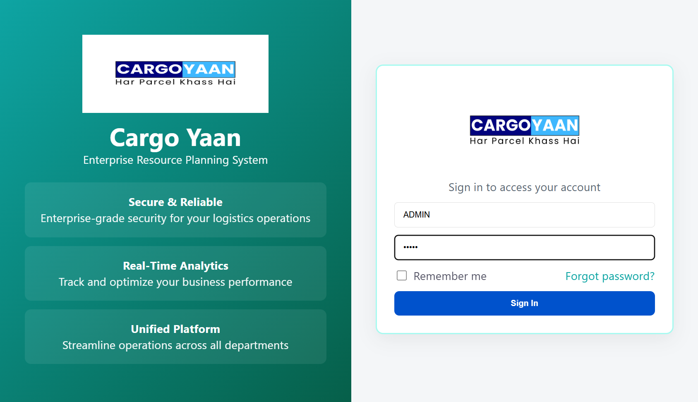

# Cargo Yaan - Enterprise Resource Planning System

**Cargo Yaan** is an enterprise resource planning system designed for logistics operations management with real-time analytics, secure authentication, and a unified platform for streamlined operations across all departments.

## Tech Stack
- **Frontend**: React + Vite + Material UI
- **Backend**: Node.js + Express
- **Database**: PostgreSQL
- **Authentication**: JWT (JSON Web Tokens)
- **Security**: Bcrypt for password hashing, CORS support

## Application Screenshot

The application features a clean, modern login interface:



*Sign in to access your Cargo Yaan account with secure JWT authentication*

## Prerequisites

Before running the application, ensure you have the following installed:
- **Node.js** (v14 or higher)
- **npm** or **yarn** package manager
- **PostgreSQL** (database server)
- **Git** (for version control)

## Installation

### 1. Clone the Repository

```bash
git clone https://github.com/Zuber8960/SSS.git
```

### 2. Navigate to the Project Directory

```bash
cd SSS
```

### 3. Install Backend Dependencies
```bash
cd backend
npm install
```

### 4. Install Frontend Dependencies
```bash
cd ../frontend
npm install
```

## Configuration

### Backend Environment Variables

Create a `.env` file in the `backend` directory with the following variables:
```
# Database Configuration
DB_HOST=your_database_host
DB_PORT=5432
DB_NAME=your_database_name
DB_USER=your_database_user
DB_PASSWORD=your_database_password

# Server Configuration
PORT=5000

# JWT Configuration
JWT_SECRET=your_secret_key_here
```

## Running the Application

### Option 1: Run Backend and Frontend Separately (Recommended for Development)

#### Terminal 1 - Start the Backend Server
```bash
cd backend
npm start
```
The backend server will start on `http://localhost:5000`

The backend uses **nodemon** for automatic restart on file changes during development.

#### Terminal 2 - Start the Frontend Development Server
```bash
cd frontend
npm start
```
The frontend development server will start on `http://localhost:5173` (Vite default port)

### Option 2: Build Frontend and Serve Together

#### Build the Frontend
```bash
cd frontend
npm run build
```

#### Start the Backend (which can serve the built frontend)
```bash
cd backend
npm start
```

## Project Structure

```
logistics-erp-production/
├── backend/
│   ├── server.js
│   ├── knexfile.js
│   ├── package.json
│   ├── config/
│   │   └── db.js
│   ├── middleware/
│   │   └── authMiddleware.js
│   ├── models/
│   │   └── userModel.js
│   └── routes/
│       └── userRoutes.js
├── frontend/
│   ├── package.json
│   ├── vite.config.js
│   ├── src/
│   │   ├── main.jsx
│   │   ├── App.jsx
│   │   ├── components/
│   │   ├── pages/
│   │   ├── services/
│   │   └── utils/
│   └── public/
├── database/
│   ├── 01_schema.sql
│   └── 02_security_tables.sql
└── README.md
```

## Available Scripts

### Backend Scripts
- `npm start` - Start the backend server with hot-reload using nodemon

### Frontend Scripts
- `npm start` - Start the development server
- `npm run dev` - Alias for development server
- `npm run build` - Build for production
- `npm run preview` - Preview production build locally
- `npm run lint` - Run ESLint to check code quality

## Features

- ✅ **Secure & Reliable** - Enterprise-grade security for your logistics operations
- ✅ **Real-Time Analytics** - Track and optimize your business performance
- ✅ **Unified Platform** - Streamline operations across all departments
- ✅ **User Authentication** - JWT-based authentication with role management
- ✅ **Admin Dashboard** - Comprehensive admin controls and settings

## API Endpoints

The backend server provides the following main endpoints:
- `POST /api/users/login` - User authentication
- `POST /api/users/register` - User registration
- Additional routes available in `/backend/routes/`

## Database Setup

Run the SQL scripts in the `database` folder to set up your database:
1. `01_schema.sql` - Create main schema
2. `02_security_tables.sql` - Create security and role tables

## Troubleshooting

### Backend won't start
- Ensure PostgreSQL is running
- Check database credentials in `.env` file
- Verify all dependencies are installed with `npm install`

### Frontend won't start
- Clear node_modules and reinstall: `rm -rf node_modules && npm install`
- Check if port 5173 is available
- Ensure backend is running on port 5000

### Database connection issues
- Verify database host, port, and credentials
- Check PostgreSQL service is running
- Ensure database user has necessary permissions
